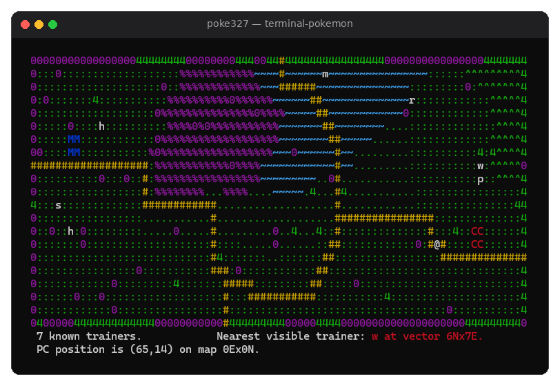
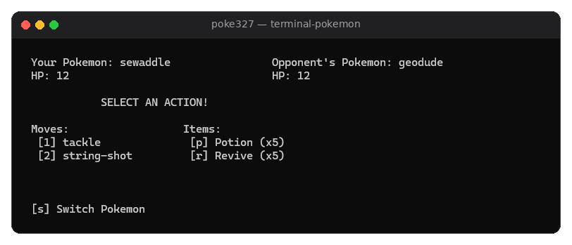
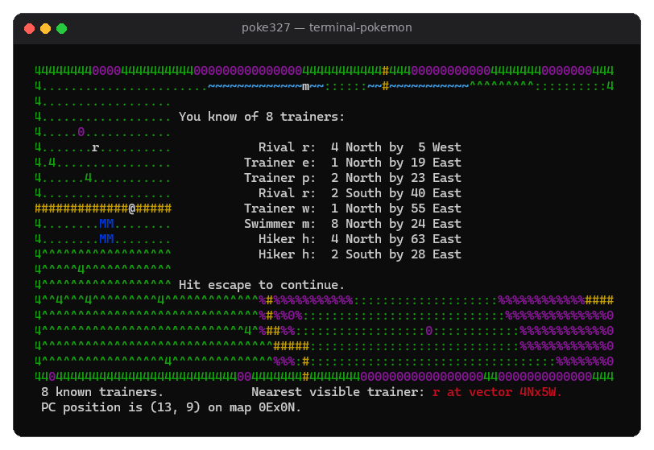

# Terminal Pokémon 🎮

A Pokémon-style role-playing game that runs entirely in the terminal, written in C++ with an ncurses interface. Explore a procedurally generated world, battle trainers, and catch wild Pokémon using real Pokédex data.

Built for COM S 3270 at Iowa State University, Spring 2026.



## Features

- **Procedurally generated world:** a 401×401 grid of maps with paths, tall grass, water, trees, Pokémarts, and Pokémon Centers
- **Turn-based battles** against trainers and wild Pokémon, with move priority, accuracy checks, and same-type attack bonuses (STAB)
- **Catching and items:** Poké Balls, potions, and revives, plus a starter Pokémon selection
- **Real Pokédex data:** parses nine CSV files into typed structs to build Pokémon with level-scaled stats, movesets, gender, and rare shiny variants
- **Difficulty scaling:** wild Pokémon and trainers get stronger the farther you travel from the center of the world
- **ncurses UI:** color map rendering, a queued message system, a scrollable trainer list, and multi-screen battle and bag menus

## Tech Stack

C++, C, ncurses, Make

## Screenshots

**Battle**


**Trainer list**


## Running It

Requires Linux, macOS, or Windows with WSL.

**1. Install a compiler and ncurses** (Ubuntu / WSL):
```bash
sudo apt install -y build-essential libncurses-dev git
```
On macOS, install the Xcode command line tools (`xcode-select --install`); ncurses is included.

**2. Download the Pokédex data** (the game reads it from `~/.poke327`):
```bash
git clone --depth 1 https://github.com/veekun/pokedex.git ~/.poke327/pokedex
```

**3. Build and run:**
```bash
make
./poke327
```

## Controls

| Key | Action |
|-----|--------|
| Arrow keys or 7/8/9/4/6/1/2/3 | Move |
| 5, `.`, or space | Wait a turn |
| `>` | Enter a Pokémart or Pokémon Center |
| `t` | List nearby trainers |
| `p` | Teleport to a random map |
| `f` | Fly to any world coordinate |
| `Q` | Quit |

## Project Structure

| File | Purpose |
|------|---------|
| `poke327.cpp` | World generation, map logic, and game loop |
| `io.cpp` | ncurses rendering, menus, and battle interface |
| `character.cpp` | Player and trainer movement and pathfinding |
| `pokemon.cpp` | Pokémon creation, stats, and moves |
| `db_parse.cpp` | CSV parsing of Pokédex data |
| `heap.c` | Priority queue used for turn order and pathfinding |

See [CHANGELOG.md](CHANGELOG.md) for the development timeline.
